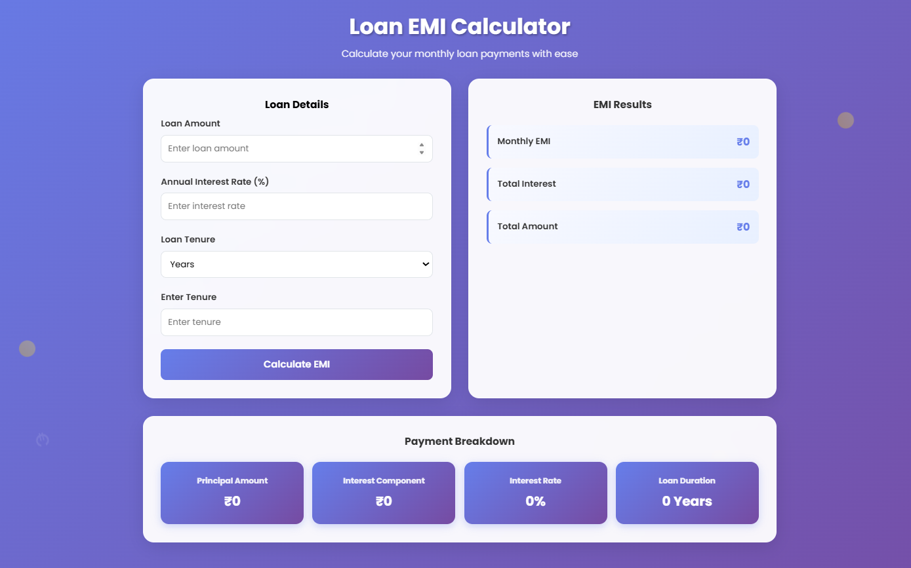

#  Loan EMI Calculator

A simple web application to calculate **monthly** and **yearly** payments for any loan. Input the loan amount, interest rate, and tenure, and get instant results.

---

##  Features

-  Calculate **Monthly EMI**
- View **Total Payment & Total Interest**
- Support for various loan tenures (in years or months)
-  Clean and user-friendly interface
-  Responsive and lightweight (HTML, CSS, JS only)

---

##  Tech Stack

- HTML5
- CSS3
- JavaScript (Vanilla)

---

##  Screenshot

> *(Add a screenshot image here if available)*

---

##  How to Use

1. **Clone the repository:**
   ```bash
   git clone https://github.com/ParthaG23/Loan_EMI_Calculator.git
